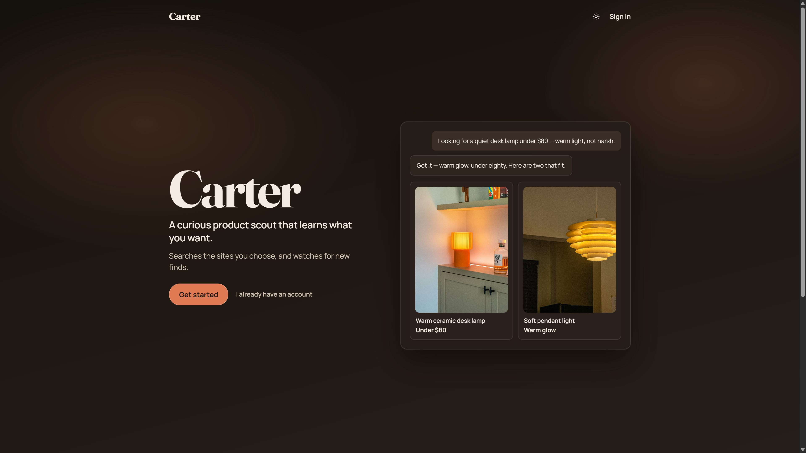

# Carter

A curious product scout that learns what you want, searches the sites you choose, and watches for new finds.

**Live app:** [https://ardent-bandicoot-155.convex.site/](https://ardent-bandicoot-155.convex.site/)



## What it does

Carter is a chat-first shopping agent. You describe what you’re looking for; Carter asks a short clarifying turn (often as tappable reply chips), remembers your preferences, then searches Amazon, Etsy, and specialty stores you pick—including stores suggested via Discover stores. Results show up as product cards you can like, pass, or save to shopping lists. Enable list alerts and Carter emails you when prices drop.

## Features

- Streaming chat agent with preference memory
- Reply chips for quick clarifying answers
- Like / pass on findings to steer later searches
- Per-query search scope: Amazon, Etsy, Discover stores, and custom domains
- Shopping lists with price-drop digests
- Multi-conversation sessions and a mobile-friendly shopping context panel
- Auth with email/password, Google OAuth, verification, and account deletion

## Tech stack

| Layer | Stack |
| --- | --- |
| Frontend | React 19, Vite, TypeScript, React Router |
| Backend | Convex (queries, mutations, actions, HTTP actions, crons) |
| AI | `@convex-dev/agent`, OpenAI GPT-4o-mini via Convex AI Gateway |
| Auth | `@convex-dev/better-auth` |
| Search / scrape | `@firecrawl/firecrawl-convex` |
| Email | `@agentmail/convex` (auth mail + digests) |
| Hosting | `@convex-dev/static-hosting` (`*.convex.site`) |

## Auth setup

Carter uses **Better Auth** via `@convex-dev/better-auth` (email/password + Google OAuth).

### Environment

Copy [`.env.example`](.env.example) to `.env.local` and fill Vite URLs from `npx convex dev`.

Set Convex deployment secrets:

```bash
npx convex env set SITE_URL http://localhost:5173
npx convex env set BETTER_AUTH_SECRET "$(openssl rand -base64 32)"
npx convex env set GOOGLE_CLIENT_ID "your-client-id.apps.googleusercontent.com"
npx convex env set GOOGLE_CLIENT_SECRET "your-client-secret"
```

`GOOGLE_CLIENT_ID` / `GOOGLE_CLIENT_SECRET` are optional on the deployment until you enable Google sign-in. Without them, email/password still works; the Google button will fail until both are set.

For production, set `SITE_URL` to the real SPA origin (never `*`). Keep `trustedOrigins` limited to that origin.

Also set Firecrawl and AgentMail secrets on the deployment (`FIRECRAWL_API_KEY`, `AGENTMAIL_API_KEY`, and related vars from `.env.example`).

### Google OAuth (required for “Continue with Google”)

1. Create an OAuth 2.0 **Web** client in [Google Cloud Console](https://console.cloud.google.com/apis/credentials).
2. **Authorized JavaScript origins:** your SPA origin(s), e.g. `http://localhost:5173` and the production site.
3. **Authorized redirect URI** must be the **Convex site** callback (not the Vite origin):

   ```
   https://<your-deployment>.convex.site/api/auth/callback/google
   ```

   Example (this deployment): `https://ardent-bandicoot-155.convex.site/api/auth/callback/google`

4. Put the client ID/secret into Convex env as above, then restart `npx convex dev`.

Password accounts require email verification (AgentMail). Google accounts are treated as verified and can link to an existing password user with the same email.

## Local development

```bash
npm install
npm run dev:backend   # npx convex dev
npm run dev:frontend  # vite on :5173
```

Production static hosting:

```bash
npm run deploy   # npx @convex-dev/static-hosting deploy
```

## Project layout

- `convex/` — schema, agent, Firecrawl search, digests, auth, shopping lists
- `src/pages/` — landing, login, chat, lists, profile
- `src/components/` — product cards, app shell, search scope UI
- `hackathon.md` — build log for the Convex All Gas Hackathon
